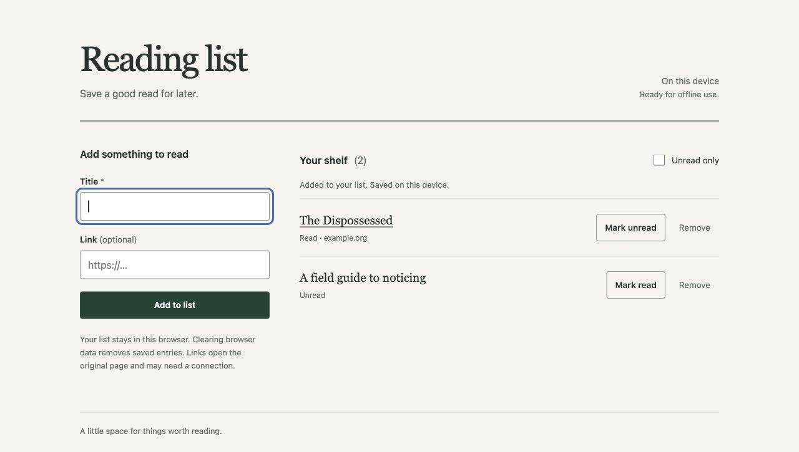

# Working examples

These are maintained examples, not the destination for projects created by users.
Copy one elsewhere to inspect its local records, or ask an agent to create a new
workspace using [BOOTSTRAP.md](../BOOTSTRAP.md).

| Project | Actual application | Evidence |
| --- | --- | --- |
| [ToolShelf](tool-shelf/README.md) | Offline catalog, lending, returns/history, overdue queries, atomic CSV preview/import, and restorable exports | Three agent-derived phases; one mid-project correction; fresh-session continuation from plain documents; 39 behavioral tests and retained CLI journeys |
| [ToolShelf renewal extension](tool-shelf-renewals/README.md) | Extends the existing ToolShelf with persistent loan renewals, legacy data compatibility and complete recovery history | Two new agent-derived phases; 54 application tests; ten withheld acceptance cases passed on the first candidate |
| [Expense totals](expense-totals/README.md) | Python CSV CLI with exact decimal totals, refunds, category filtering, and strict input errors | Behavioral CLI tests; independent creation and fresh-session feedback/resume exercise; local completion history |
| [Reading list](reading-list/README.md) | Static offline reading list with local persistence, read toggles, filtering, and error states | Node behavioral tests; recorded desktop/mobile browser observations with source fingerprints and screenshots |

ToolShelf is the readable baseline demonstration. It began with a brief and the operating
method, with no prepared plan or application. The active agent derived phases and local
guidance, implemented and repaired behavior, and continued across phases. A fresh session
recovered the interrupted correction from local Markdown and finished the build. It uses
ordinary Python tools and has no Noetloom helper, native discovery directories or JSON
workflow records. [The observation](../docs/evidence/readable-autonomy/README.md) distinguishes
the native run, primary review repair, current tests and proof limits.

The renewal extension starts from that completed application and a new outcome. Its agent
inspected the existing architecture, derived its own phases and completed the change using
plain files and ordinary tools. The implementation agent performed a final requirements
review before declaring completion; independent acceptance then ran against the preserved
candidate. [The maintenance observation](../docs/evidence/existing-application/README.md)
records frozen cases, the first result and separate finding categories. Both application
versions remain self-contained so earlier evidence and compatibility can be reproduced.

Expense totals and Reading list retain the optional helper profile: copied helper,
canonical lifecycle/domain skills, thin Claude entries, manifest, owners and evidence.
Neither needs this repository on Python's import path. The expense example combines
document roles; the website keeps separate owners. The
examples' applications are Apache-2.0 as repository code. This does not assign the
same license to independent applications made with the generator.

The expense example's feedback log labels the simulated correction, question, pause,
and resume used to test the framework. The new agent received local project files
and “Continue,” without the original conversation or private skills. It preserved
deferred sharing, databases, and authentication while implementing the requested
filter. A later arithmetic review exposed and repaired a large-value precision bug.
Historical records are retained; current completion points to the revalidated result.

